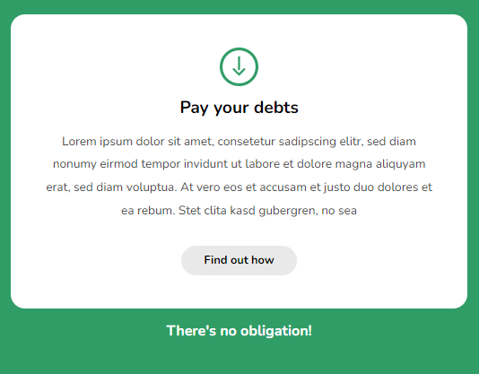

## Table of contents

- [Overview](#overview)

- [Projects](#projects)

  - [Design Challenge 1](#design-challenge-1)
  - [Design Challenge 2](#design-challenge-2)
  - [Design Challenge 3](#design-challenge-3)
  - [Design Challenge 4](#design-challenge-4)
  - [Design Challenge 5](#design-challenge-5)
  - [Design Challenge 6](#design-challenge-6)
    
    
  ## Overview

  Completed these projects that are parts of [Scrimba](https://scrimba.com/learn/frontend/)'s Learn UI Design Module. I mastered HTML/CSS and UI design concepts in these projects. I learned UI design concepts following;
  - White Space
  - Color 
  - Contrast 
  - Scale
  - Alignment
  - Typography
  - Visual Hierarchy
  
  You can see the visual representations of the each app below.
  

  ## Projects

  ### Design Challenge 1

  ### Visualization of the app;
  
  
  ### Design Challenge 2

  ### Visualization of the app;
  
  
  ### Design Challenge 3

  ### Visualization of the app;
  
  
  ### Design Challenge 4

  ### Visualization of the app;
  
  
  ### Design Challenge 5

  ### Visualization of the app;
  
  
  ### Design Challenge 6

  ### Visualization of the app;
  
 
 
 
 
 
  
  
